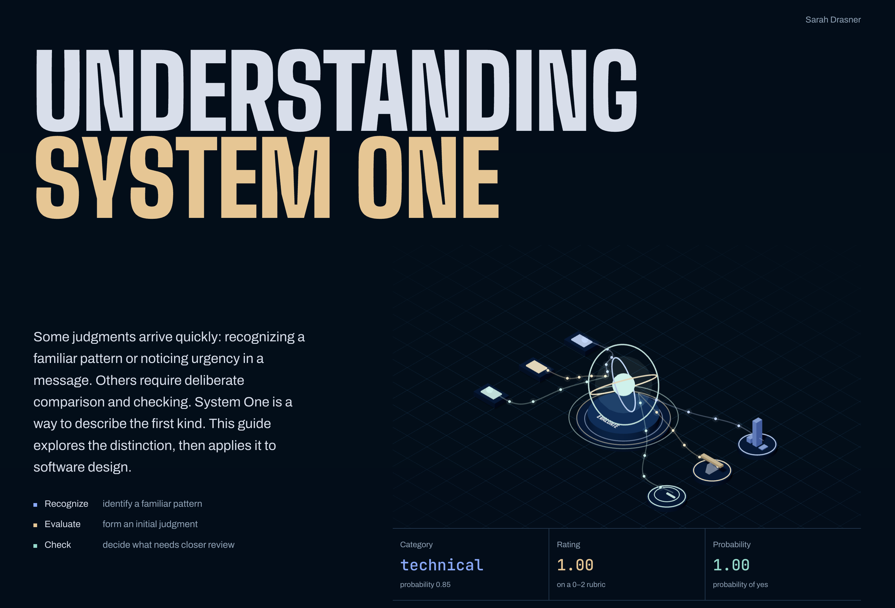

# System One: an interactive guide

An interactive introduction to System One: fast, automatic judgments, how they differ from deliberate checking, and how this distinction can inform software design. The guide uses interactive examples to explain classification, scoring, confidence, and the policies that determine when a prediction should lead to an action.

[Open the live demo](https://system-one-explainer.netlify.app/).



## What the guide covers

- Fast judgments and deliberate reasoning as modes of thinking.
- Classification and scoring as software examples of bounded judgments.
- Thresholds, confidence, and checks between a prediction and an action.
- Combining independent judgments into a workflow.
- Limitations of the analogy and of model predictions.

The final section uses the Jev × WebMCP Chrome extension as a case study. It shows how a specific model and a browser tool interface implement these ideas through tool discovery, schema-derived questions, argument assembly, and execution policy.

## Run locally

```sh
npm install
npm run dev
npm run build
```

## Content boundaries

- The psychological introduction draws on [Daniel Kahneman’s Nobel lecture](https://www.nobelprize.org/prizes/economic-sciences/2002/kahneman/lecture/). System 1 and System 2 describe modes of processing, not literal brain compartments or a universal taxonomy of AI architectures.
- The classification, weighted-mean, threshold, and workflow instruments are software teaching examples. Their probabilities and timing are illustrative, not measurements of human cognition.
- [TypeSafe’s System One terminology](https://docs.typesafe.ai/concepts/system-one) and [Jev quickstart](https://docs.typesafe.ai/introduction/quickstart) are discussed in the final case study. Choice, Score, Noul, and distribution-derived confidence are specific API details.
- Model-specific limitations in the case study link to [Jev’s version-specific documentation](https://docs.typesafe.ai/model-jaggedness/jev-1.13).
- The WebMCP replay uses synthetic routing probabilities. Its call and 164 ms label reproduce the extension README example and are not a benchmark.

Reviewed September 20, 2026. No demo makes model requests.

## Implementation

Copy and sections: `index.html`. Styling: `src/style.css`. Three.js and SVG scenes: `src/scenes/`. Shared rendering and animation: `src/lib/`.

Three.js instruments include an animated workflow core, a two-path thinking illustration, probability towers, a balance beam, a probability dial, and a request-response case study. Controls retain exact textual values and keyboard operation. The opening motion can be paused; reduced-motion preferences disable ambient animation and camera parallax. Offscreen stages suspend rendering.
